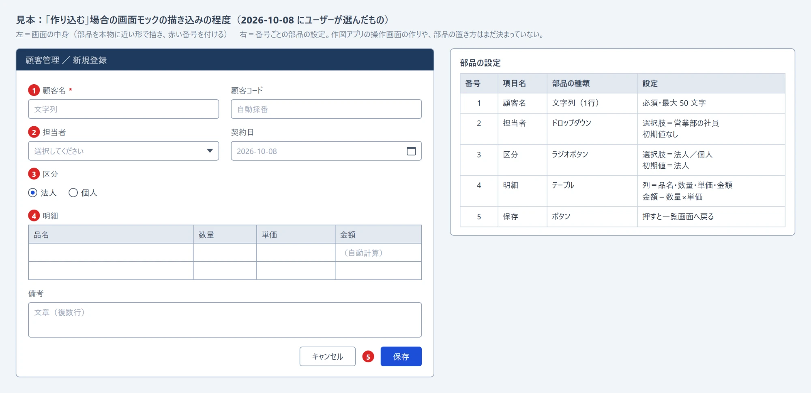

# 画面モックアプリ 引継書

- 作成: 2026-10-08（Claude Code・ユーザーの指示による）
- 作成元: ビジネスダイアグラムメーカーのリポジトリ（GitHub `ashikagagassoumu-cmd/BusinessDiagramMaker`・最新版 `diagram_v8.31.html`）

kintone のようなノーコード開発基盤で作る業務アプリの画面設計（モック）を描き、ベンダーと共有するための作図アプリを、新しいリポジトリで作り始めるための引継ぎです。
新しいリポジトリで動く Claude は、ビジネスダイアグラムメーカーのリポジトリも、そこで貯めた記憶（memory）も読めません。作業に要るものは、すべてこのフォルダに入れました。

---

## 1. このフォルダの中身

| ファイル | 中身 | 使い方 |
|---|---|---|
| `引継書.md` | このファイル | 新しいリポジトリの直下に置く |
| `新リポジトリ用_CLAUDE.md` | 新しいリポジトリの CLAUDE.md の雛形 | 直下に `CLAUDE.md` という名前で置く |
| `仕上がりイメージ.png` | ユーザーが選んだ「作り込む」程度の見本 | 2 章を参照 |
| `参考/diagram_v8.31.html` | ビジネスダイアグラムメーカー最新版の写し | 土台の部品を写すときに読む（6 章）。編集しない |
| `参考/AI向け仕様書.md` | ビジネスダイアグラムメーカーの仕組みの説明 | 書かれている行番号は古い。関数名で探す |
| `参考/serve.js` | 検証用の小さな Web サーバー | 既定で開くファイル名 `/diagram_v8.31.html` を、新しいアプリのファイル名に書き換えて使う |
| `参考/block-main-push.js` | `main` への直接 push を止めるフック | 9 章の手順で設定する |

---

## 2. 決まっていること（2026-10-08・ユーザーが選んだもの）

Claude が「別アプリにするか、ビジネスダイアグラムメーカーに入れるか」を助言し、ユーザーが 3 つの選択肢から「作り込む・別アプリ」を選びました。そのうえで「別アプリなら別のリポジトリを立てる」とユーザーが決めました。



- **描き込みの程度は「作り込む」。**
  - 画面の枠の中に、入力欄・選択欄（ドロップダウン）・ラジオボタン・表・ボタンを、本物に近い形で並べる（画像の左）。
  - 部品に赤い番号を付け、番号ごとに「必須」「選択肢」「初期値」などの設定を一覧表で添える（画像の右）。
- **1 つのファイルに、複数の画面を入れられるようにする。** 例: 一覧画面・新規登録画面・詳細画面。
- **ビジネスダイアグラムメーカーには入れない。** 別の HTML ファイルの別アプリとして、別のリポジトリで作る。
- **保存・印刷などの土台は、ビジネスダイアグラムメーカーから写す。** 部品の一覧は 6 章。

画像は描き込みの程度を見せるための見本です。作図アプリの操作画面の作りや、部品の置き方はまだ決まっていません（4 章）。

---

## 3. 別アプリにした理由

同じ議論を新しいリポジトリで繰り返さないために残します。数字は 2026-10-08 に `diagram_v8.31.html` を調べた結果です。

1. **画面モックに要る中心の仕組みが、ビジネスダイアグラムメーカーにない。**
   - 画面モックの中心は、次の 3 つです。
     - 画面の枠を動かすと中の部品も一緒に動く入れ子
     - 部品の種類ごとの見た目
     - 必須・選択肢・初期値などの部品の設定
   - ビジネスダイアグラムメーカーのグループ枠は、中のシェイプをまとめて選べるだけです。枠を動かしても中身は付いてきません。
   - 中にある自動の処理は、レーン・接続線の自動経路・文字量に合わせて箱を大きくする処理で、画面モックでは止める必要があります。
   - そのため、同梱しても新しく作る量はほとんど減りません。
2. **既存の図を壊す心配と、確かめる手間が増える。**
   - `diagram_v8.31.html` は 17,752 行・約 2.1 MB で、関数は約 900 個あります。
   - 図の種類ごとに処理を分けている箇所が約 120 か所、レーンの有無で分けている箇所が 82 か所あります。
   - 同梱すると、画面モックを直すたびに既存の 10 種類の図も確かめる必要が出ます。逆も同じです。
3. **ビジネスダイアグラムメーカーは「1 つのファイルに 1 つの図」。** 複数の画面を 1 つのファイルに入れる仕組みを足すと、10 種類の図すべてに響く改造になります。
4. **ベンダーに渡すファイルが軽くなる。** 保存ファイルにはアプリ本体ごと入ります。ビジネスダイアグラムメーカーの保存ファイルは約 2.1 MB で、そのうち約 0.86 MB はガント工程表の Excel 出力用の部品（ExcelJS）です。

同梱した場合の利点は、土台を作らずに済むこと、操作が同じこと、直すファイルが 1 つで済むことでした。前の 2 つは、土台を写すことで別アプリでも得られます。残る弱点は、土台の不具合を直したときに両方へ同じ直しを入れる手間です。

---

## 4. まだ決まっていないこと（新しいリポジトリで最初に、1 問ずつ聞く）

上から順に聞きます。答えによって後の質問が変わるためです。見た目に関わる質問（3・4・5）には、HTML のモックを描画したスクリーンショットを添えます。

1. **部品の名前と種類を kintone に合わせるか。**
   - 合わせる場合の例: 文字列（1 行）・文字列（複数行）・数値・計算・ドロップダウン・ラジオボタン・チェックボックス・日付・ユーザー選択・テーブル・ルックアップ・関連レコード一覧・グループ・スペース・罫線
   - 合わせない場合は、テキストボックスなどの一般的な名前にする。
   - あわせて、作る先の基盤が kintone に決まっているかも聞く。
2. **どの画面まで描くか。**
   - 入力・詳細の画面（フォーム）だけにするか。
   - 一覧画面（レコードを表で並べる画面）、グラフ、プロセス管理（ステータスと操作ボタン）まで描くか。
3. **部品の置き方。** kintone のフォーム編集と同じく行に左から詰めて並べるか、好きな位置に置くか。
4. **部品の設定の見せ方。**
   - 番号と一覧表（画像の右）だけにするか、吹き出しも使うか。
   - 一覧表を画面の横に置くか、下に置くか。印刷したときにどう並ぶか。
5. **複数の画面の持ち方。**
   - 画面ごとにページを切り替えるか、1 枚の大きな図に並べるか。
   - 印刷と PNG は 1 画面ずつにするか。
6. **ベンダーへの渡し方。** 保存した HTML ファイルをそのまま渡すか、印刷して PDF にするか、PNG 画像にするか。
7. **アプリの名前、ファイル名と版番号の付け方。**
   - ビジネスダイアグラムメーカーは `diagram_v8.31.html` のように版番号をファイル名に入れています。
   - 版を上げるときは `git mv` で名前を変え、古い版のファイルは残していません（Git の履歴から戻せます）。
8. **新しいリポジトリの公開範囲。**
   - ビジネスダイアグラムメーカーは public です。
   - 公開にする場合、社内の実際の画面・業務の画像・PDF はコミットしません。
9. **画面のつながりをどこで描くか。** 画面を箱、画面から画面への移り方を矢印にした図のことです。Claude の案は 5 章です。

---

## 5. 2 つのアプリの役割分担（Claude の案・ユーザー未確認）

- ビジネスダイアグラムメーカーで描くもの:
  - 画面のつながり（フローチャート）
  - ステータスの流れ（状態遷移図）
  - 業務フロー（スイムレーン）

  どれも、ビジネスダイアグラムメーカーにすでにある図の種類で描けます。
- 新しいアプリで描くもの: 画面の中身。

---

## 6. 土台として写す部品（`参考/diagram_v8.31.html` から）

行番号は v8.31 の時点の目安です。関数名で検索して探してください。

どの部品も、ビジネスダイアグラムメーカーの状態 `S`（`lanes`・`nodes`・`edges` など）や画面の HTML 要素に依存しています。そのまま貼り付けず、新しいアプリの状態の形に合わせて書き直しながら写してください。

### 6-1. 保存と読み込み

いちばん慎重に写す部分です。7-1 の注意点を先に読んでください。

| 関数など（行） | 役割 | 写すときの注意 |
|---|---|---|
| `buildSaveHtml`（L14113） | `document.documentElement.outerHTML` を丸ごと文字列にし、`<head>` に `<script id="swimlane-state">window.__SWIMLANE_STATE__={...}</script>` を差し込む。保存ファイルはアプリ本体と図のデータが入った 1 つの HTML になる | 埋め込みの名前（`swimlane-state`・`__SWIMLANE_STATE__`）は新しいアプリ専用の名前にする。同じ名前だと、ビジネスダイアグラムメーカーの保存ファイルを読み込めてしまう |
| `init`（L2827） | 起動時に `window.__SWIMLANE_STATE__` があれば図を復元する | 上と同じ名前に合わせる |
| `importStateFromHtml`（L15607）・抽出（L15567 付近） | 保存ファイルを読み込む（インポート） | 同上 |
| `overwriteSave`（L14056）・`saveAsWithPicker`（L14023） | 上書き保存と名前をつけて保存（File System Access API の `showSaveFilePicker`） | 保存画面の `id:'bdm-save'` が同じだと、前回開いたフォルダの記憶を両アプリで共有する。分けるかどうかはユーザーに聞く |
| `askBindSaveTarget`（L13964）・`bindPickExisting`（L13996） | 保存ファイルを開いた直後に「このファイルに上書き保存しますか？」と聞き、上書き先を決める | 7-1 の「許可は約 5 秒」に注意 |
| `FH_DB='bdm-file-handles'`（L13891） | 上書き先のファイルハンドルを IndexedDB に「docId→ハンドル」で記録する | **必ず別の名前にする。** file:// のページ全部で共有されるため、同じ名前だとビジネスダイアグラムメーカーの記録と混ざる |

### 6-2. 未保存の検知と確認

| 関数など（行） | 役割 | 写すときの注意 |
|---|---|---|
| `docState`（L13872）・`docFingerprint`（L13878）・`markSaved`（L13881）・`isDirty`（L13882） | 保存する内容そのものを文字列にし、最後に保存した時点と比べる | 元に戻すの履歴に載らない設定（用紙サイズなど）も、保存する内容に入れておけば検知できる |
| `beforeunload`（L15839） | タブを閉じるときに止める | ブラウザの固定文のダイアログしか出せない |
| `confirmSave4`（L2485）・`showConfirm`（L2471） | 「上書き保存／名前をつけて保存／保存しない／キャンセル」の 4 択と、確認のダイアログ | |
| `saveErrText`（L13936）・`toast`（L17057）・`hint`（L17005） | 保存の結果と失敗の原因を日本語で出す（画面中央の通知と、画面下の案内） | |

### 6-3. 元に戻す

| 関数など（行） | 役割 |
|---|---|
| `snap`（L4269）・`restore`（L4275） | 状態を JSON にして最大 80 段まで積む（Ctrl+Z／Ctrl+Y） |

### 6-4. 書き出しと印刷

| 関数など（行） | 役割 | 写すときの注意 |
|---|---|---|
| `buildExportSvg`（L14837） | 画面の SVG を複製し、`class="ui-only"`・`flow-ctrl` の要素（ハンドルや案内の線）を落とす。PNG・SVG・印刷は全部ここを通る | 画面操作用の要素には `ui-only` を付ける約束も写す |
| `expPNG`（L15237）・`expSVG`（L14917）・`expPDF`（L14944） | 書き出し。印刷は別ウィンドウに印刷用の HTML を開き、ブラウザの印刷ダイアログへ渡す | `@page` の扱いは 7-2 を読んでから決める |
| `printPagePlan`（L14533） | シェイプやグループ枠を途中で切らない改ページ位置を決める | 画面モックでは「画面 1 枚を途中で切らない」に置き換わる見込み |

### 6-5. 文字の編集

| 関数など（行） | 役割 | 写すときの注意 |
|---|---|---|
| `openSvgEditor`（L13356）・`closeSvgEditor`（L10937） | 図の上に重ねる編集欄（Enter で確定・Alt+Enter で改行・Esc で取り消し） | 枠線は `border` でなく `outline` で描く。ブラウザの表示倍率が 80% などのとき、Chrome は border の太さを丸めて文字欄が 0.5px 狭くなり、最後の 1 文字だけ次の行へ落ちた（v8.29） |
| `wrapText`（L2202）・`charW`（L2194）・`textW`（L2329）・`TEXT_FONT`（L2192） | 折り返し位置の計算（canvas で 1 文字ずつ幅を測る） | 編集欄と確定後の描画で同じ物差しを使う。違うと、編集中と確定後で折り返しがずれる（v8.26） |

### 6-6. 拡大縮小と画面の移動

| 関数など（行） | 役割 |
|---|---|
| `applyZoom`（L15668）・`syncZoomSpacer`（L15654）・`zoomAtPointer`（L16775） | 拡大縮小（Ctrl+ホイール）と、図の端まで送れるスクロールの余白 |
| `initHandTool`（L11633） | ハンドツール（つかんで画面を動かす） |
| `chordToggleMode`（L11703） | 左右のボタンの同時押しで、選択とハンドツールを切り替える |
| `svgPt`（L4281） | マウスの位置を図の座標に変換する |

### 6-7. 小さな部品と見た目

| 関数など（行） | 役割 |
|---|---|
| `placePopupAt`（L1626） | ポップアップの実際の大きさを測り、画面の内側に収めて置く |
| `bindOutsideClose`（L1635） | ポップアップの外を押したら閉じる。図の中を押しても閉じるよう、キャプチャ段階で拾う |
| CSS（L7〜L469） | メニューバー（Office 風にジャンルごとに縦線で仕切る）と配色 |

### 6-8. 写さないもの

- ExcelJS（L474〜L518・約 0.86 MB）
- レーン
- 接続線の自動経路と接続点の割り当て
- ガント工程表
- マインドマップ

---

## 7. これまでの開発で分かった注意点

ビジネスダイアグラムメーカーの開発で、実際に起きたこととその対処です。新しいリポジトリでは記憶（memory）が空から始まるので、ここに写しました。

### 7-1. 保存

- **保存ファイルにはアプリ本体ごと入る。**
  - ユーザーは保存ファイルをダブルクリックで開きます。そのとき動くのは「そのファイルを保存した版」のアプリです。
  - 保存や起動の動きを直しても、新しい版で保存し直したファイルからしか効きません。
  - 保存まわりを直す提案をするときは、このことを最初に伝えます（2026-09-29）。
- **Chrome の保存画面は、既存のファイルを選んだ時点でそのファイルを空にする。**
  - 中身が入るのは、アプリが書いたときだけです。選んだら、ほかの `await` を挟まずにすぐ書きます。
  - v8.31追補⑭で、選んだ後・書く前に照合の処理を挟みました。その結果、ユーザーの Chrome でファイルが空のまま残りました（2026-10-02 の報告）。
- **書き込みの許可（`requestPermission`）は、ページ上で押してから約 5 秒しか求められない。**
  - ファイル選択画面にいた時間も 5 秒に含まれます。許可を求める処理を、ファイル選択画面や重い処理の後ろに置きません。
  - 5 秒を過ぎると黙って失敗し、上書き先が決まらないまま次の Ctrl+S でもう一度保存画面が出ました（v8.31追補㉕・2026-10-08）。
- **上書き保存を Office 寄りに作り替えたら不具合が続き、ユーザーの指示で撤回した。**
  - 作り替えの中身は、開いた直後の確認をやめることと、ファイル名と図の名称を切り離すことでした（v8.31追補⑭⑯ → 追補⑲で撤回・2026-10-06）。
  - 写すのは撤回後の今の形（開いた直後に上書き先を確かめる）です。作り替えをこちらから提案しません。
- **IndexedDB の形を変えない。** 古い版で保存したファイルも同じ DB を読みます。DB の版・ストア・値の形を変えず、新しい情報は新しいキーで足します。

### 7-2. 印刷と見え方

- **印刷用 HTML の `@page` に用紙の寸法（`size`）を出すかどうかで、ユーザーの決定が 4 回往復した。**
  - `size` を出すと、送信先が「PDFに保存」のときは用紙と向きがアプリの指定どおりになります。
  - PDF24・Microsoft Print to PDF・実際のプリンターでは向きが縦に固定され、横長の図が横倒しで載ります。
  - 最後の決定は「出す。送信先は『PDFに保存』と案内する」です（v8.31追補⑥・2026-09-25）。
  - 新しいアプリでどうするかは、この経緯を見せてから最初に確認します。印刷の不具合の報告では、まず送信先を聞きます。
- **見え方の直しは、3 つの見え方で確かめる。**
  - 「太く」「見えるように」といった直しは、画面 100%・用紙の幅に縮めた印刷・PNG の 3 つで確かめます。
  - 2px の外枠は印刷で約 0.2mm になり、ユーザーから「実装されていない」と再報告されました（2026-09-17）。
  - 線の太さは、隣の線との比で決めます。

### 7-3. 検証の環境（社内の Windows PC）

- **Puppeteer はシステムの Chrome をプロキシ直結で使う。**
  - リポジトリの Puppeteer（25.x）は、同梱の Chrome が見つからずに落ちます。
  - 社内のプロキシのせいで、`localhost` へのアクセスも 30 秒で時間切れになります。
  - 次の設定で起動します。

  ```js
  puppeteer.launch({ headless: true, channel: 'chrome',
    args: ['--no-sandbox', '--proxy-server=direct://', '--proxy-bypass-list=*'] })
  ```

- **検証用のサーバーは別のポートで立てる。**
  - 例: `PORT=8766 node serve.js`。8765 は別のプロセスが使っていることがあります。
  - 未保存の状態でページを読み直すと「このページを離れますか」で止まります。先に `page.on('dialog', d => d.accept())` を登録します。
  - 2 つのページを並べて比べるときは、操作の前に `await page.bringToFront()` を呼びます。呼ばないと、裏のページは操作も撮影も止まります。
- **ヘッドレスの Chrome はスクロールバーの幅が 0。** スクロールバーが原因の不具合は、`ignoreDefaultArgs: ['--hide-scrollbars']` を付けて確かめます（v8.27追補）。
- **ユーザーの画面に、実際のブラウザのウインドウを出して操作しない。**
  - キー操作を送ると、ユーザーが使っている Chrome を引っ張ります（2026-09-15）。
  - ブラウザの表示倍率は、プロファイルの `Default/Preferences` に `{"partition":{"default_zoom_level":{"x":ln(倍率)/ln(1.2)}}}` を書いて再現します。
- **ヘッドレスでは確かめられないことがある。**
  - クリップボードは Windows のものとは別です。
  - `page.evaluate` は操作したものとして扱われ、`userActivation` が立ちます。
  - file:// のページでは OPFS が使えません。保存画面の検証は、HTTP でファイルを配り、`showSaveFilePicker` を「OPFS のハンドルを返す処理」に差し替えて行います。
  - 本物の保存画面と許可の確認はヘッドレスでは押せないので、実機での確認をユーザーに頼みます。
- **Puppeteer 25 の細かい挙動。**
  - `page.pdf()` は `Uint8Array` を返します。ページ数を数えるなら `Buffer.from(buf).toString('latin1')` で `/Type /Page` を数えます。
  - ダブルクリックは `mouse.click(x, y, {count: 2})` です。
  - 範囲を切った撮影には `captureBeyondViewport: false` を付けます。付けないとホバー表示が写りません。
- **Claude デスクトップアプリのブラウザペインは、file:// の PDF も `window.open` も開けない。** PDF の見た目は、用紙の大きさの枠に印刷用 HTML を載せて撮ります。PATH に `pdftoppm` もありません。

### 7-4. ファイルの編集

- **CRLF のファイルに Git Bash の `sed -i` を使うと CR が消える。** Edit ツールで直し、`git ls-files --eol` で `w/crlf` になっているか確かめます。
- **Edit ツールの `replace_all` は部分一致。** `n.type===` を一括置換したら、`gn.type===` の中まで壊れました。置換の後に、前に文字が付いた残骸を grep で探します。
- **2 MB 級の HTML で、Read ツールや Grep が誤った結果を返したことがある。** 実在しない内容や、ずれた行番号が返りました（2026-06）。怪しいときは、PowerShell の `[IO.File]::ReadAllText` と `[regex]::Matches(...).Count` で直接数えます。
- **Git Bash は日本語のファイル名・文字列が苦手。** 日本語が絡む処理は PowerShell で行います。

### 7-5. 進め方（ユーザーの好み）

- 確かめたいこと（設計案の了承・方針の選択）は、文章でなく AskUserQuestion で 1 問ずつ聞く。
- 設計の話は、ふつうの言葉と、変える前・変えた後の絵で説明する。コードの用語は実装の段階まで出さない。
- 見た目は、HTML のモックを描画したスクリーンショットで見せる（ユーザー共通のルール）。
- 形を変えるときは、そこから派生する細部（接続点・編集欄・自動のサイズ調整など）を、指示がなくても補う（2026-09-11 の指摘）。
- 再現しない不具合は、小さな図で試すより、ユーザーの実際のファイルをリポジトリの中に置いてもらい、要素を半分ずつ減らして原因を絞る。

---

## 8. 運用ルール（ビジネスダイアグラムメーカーと同じにする案）

ビジネスダイアグラムメーカーの CLAUDE.md の「運用」から写しました。新しいリポジトリで採用するかは、ユーザーに確認します。

- `main` へ直接 push しない。feature ブランチを切り、PR を出してマージする。版ごとのマージの履歴を残すことが、GitHub を使ういちばんの目的（2026-06-29 のユーザー指示）。
- PR は、ユーザーが明示的に指示するまで作らない。
- 版を上げるのは、ユーザーが明示的に指示したときだけ。指示がなければ、機能を足しても版はそのままで「追補」として記録する（2026-09-25）。
- 1 セッション＝1 版＝1 PR。
- PR のタイトルは `#v<メジャー版>-<連番>` で始める。連番はメジャー版ごとに 1 から数え直す。
- 何を変えたかはコミットメッセージに、なぜ・経緯は `開発記録*.txt` に書く。
- 公開リポジトリなら、社内の実際の画面・業務の画像・PDF はコミットしない（`.gitignore` で `screenshots/` などを除外する）。

---

## 9. 新しいリポジトリでの始め方

1. このフォルダの中身を、新しいリポジトリの場所へ移す。
2. `新リポジトリ用_CLAUDE.md` を、直下の `CLAUDE.md` に名前を変える。
3. Git を始め、`.gitignore` を作る（`node_modules/`・`screenshots/` など）。
4. 検証用に Puppeteer を入れる。ビジネスダイアグラムメーカーは `"puppeteer": "^25.0.4"` を使っている。
   ```
   npm install puppeteer@^25.0.4
   ```
5. `main` への直接 push を止めるフックを設定する。
   - `参考/block-main-push.js` を `.claude/hooks/` に置く。
   - `.claude/settings.json` に次を書く（パスは新しいリポジトリの場所に合わせる）。
   ```json
   {
     "hooks": {
       "PreToolUse": [
         { "matcher": "Bash",
           "hooks": [ { "type": "command",
             "command": "node \"<新しいリポジトリの絶対パス>/.claude/hooks/block-main-push.js\"",
             "statusMessage": "main直push ガード" } ] }
       ]
     }
   }
   ```
   - PowerShell から push する場合も止めたいなら、`matcher` に `PowerShell` を足す。今のフックは Bash だけを見ている。
6. 公開範囲を決めてから、GitHub にリポジトリを作る。
7. 新しいセッションで、Claude に次のように頼む。
   「引継書.md を読んで、4 章のまだ決まっていないことを 1 問ずつ聞いて」
8. ビジネスダイアグラムメーカーのリポジトリに残った `引継_画面モックアプリ/` は、移し終えたら消す。Git の管理外なので、消しても履歴には影響しない。
